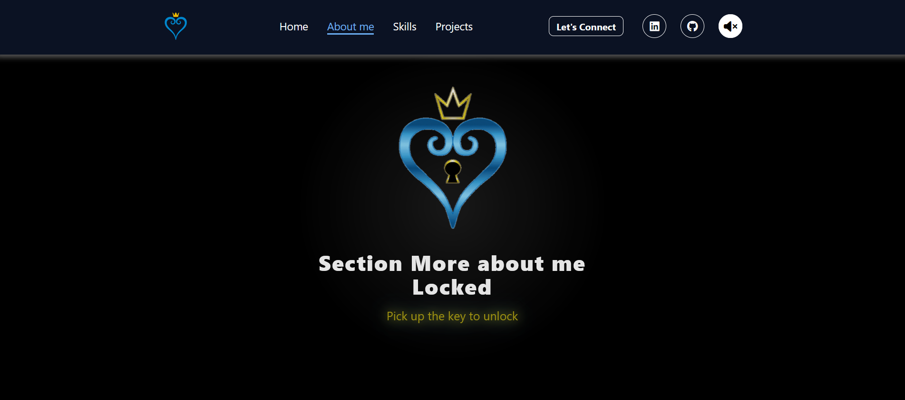
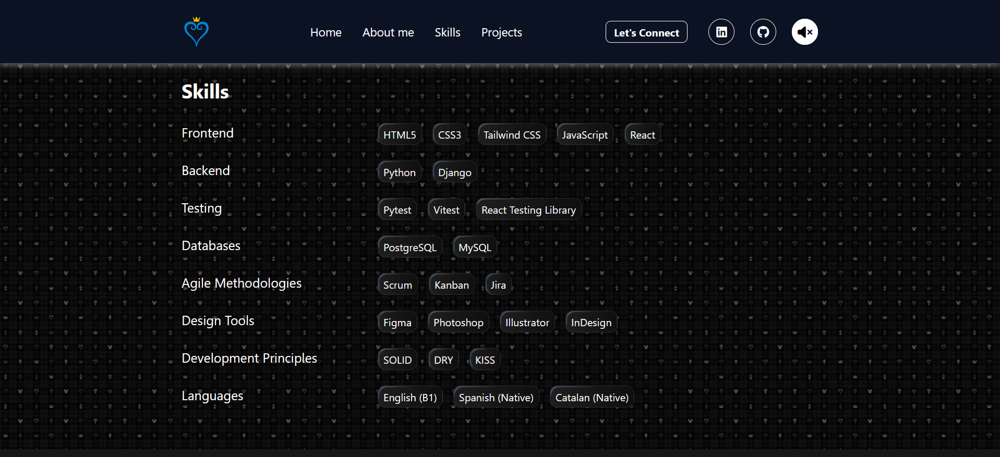
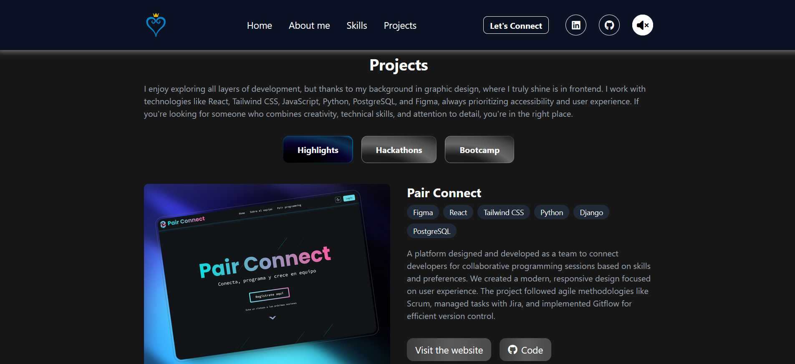
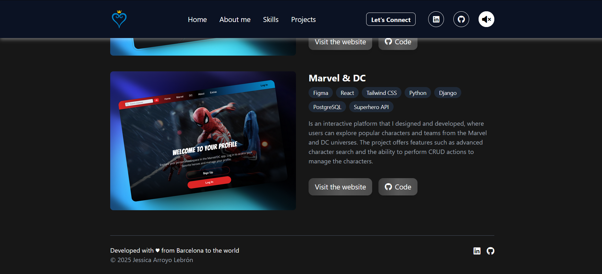

# 💻 Portfolio of Jessica

This portfolio showcases my projects, skills, and experience in web development, with a focus on accessibility, SEO, and best practices. This project reflects my commitment to functional, scalable, and visually appealing design. Is inspired by the themes and aesthetics of the Kingdom Hearts video game series, blending creativity and design with functionality.


## 📋 Table of Contents

- [💻 Portfolio of Jessica](#-portfolio-of-jessica)
  - [📋 Table of Contents](#-table-of-contents)
  - [🔧 Prerequisites](#-prerequisites)
  - [🛠 Installation](#-installation)
  - [📦 Technologies Used](#-technologies-used)
  - [🚀 Getting Started](#-getting-started)
  - [✨ Features](#-features)
  - [🖼 Screenshots](#-screenshots)
  - [🎞️ GIFs](#️-gifs)
  - [🤝 Contributions](#-contributions)
  - [📞 Contact](#-contact)

## 🔧 Prerequisites

- [Node.js](https://nodejs.org/)

## 🛠 Installation

**Clone this repository:**

```bash
   git clone https://github.com/jess-ar/portfolio-jess-ar.git
```

**Access the project:**

```bash
   cd portfolio-jess-ar
```

**Install dependencies:**

```bash
   npm install
```

## 📦 Technologies Used

This portfolio uses the following technologies:

- **React**: Library for building user interfaces.
- **TailwindCSS**: CSS framework for efficient and rapid styling.
- **clsx**: For handling conditional classnames.

## 🚀 Getting Started

**Development Mode:**

```bash
   npm run dev
```

This command starts the development server. Code changes will be reflected automatically.

## ✨ Features

- **Responsive Design**: Adapted for mobile, tablet, and desktop devices.
- **Enhanced Accessibility**: Utilizes semantic tags and is optimized for screen readers.
- **SEO Optimized**: Meta tags and structure focused on improving search engine visibility.
- **Easy Scalability**: Modular structure that allows for integrating new features seamlessly.

## 🖼 Screenshots







## 🎞️ GIFs  

Here are some animated previews of the portfolio in action:  

**Kingdom Hearts Soundtrack Playlist:**  
  

**Keyblade Unlocking a Section:**    
  

**Skills Section:**  
  

**Projects Section:**  
  

## 🤝 Contributions

Contributions are welcome! If you have suggestions, ideas for improvements, or find any issues, feel free to open an issue or submit a pull request.

**Steps to Contribute:**

1. Fork the repository.
2. Create a branch for your feature:
   ```bash
   git checkout -b feature/new-feature
   ```
3. Make your changes and commit them:
   ```bash
   git commit -m "feature: clear description of the change"
   ```
4. Submit a pull request.

## 📞 Contact

If you have any questions or want to collaborate, feel free to contact me:

- **Email:** [jessica.arroyo.lebron@gmail.com](mailto:jessica.arroyo.lebron@gmail.com)
- **LinkedIn:** [Jessica Arroyo Lebrón](https://www.linkedin.com/in/jessica-arroyo-lebron/)

---

Thank you for visiting my portfolio! If you like it, consider giving it a star on GitHub. ⭐️